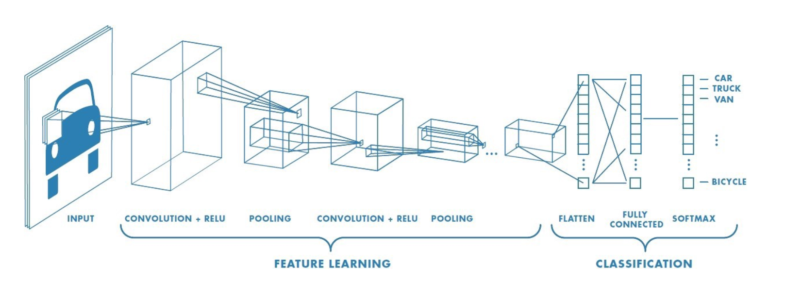

# CNN Project – Image Classification Son  vs  Not-Son
I have done my project in Convolution Neural Network [CNN] for Image Classification. The Convolution neural network is belongs to the deep learning neural networks. CNN is widely recognised in  image recognition in the 21st century especially last 1 Decade with the extensive research, generation of huge data sets from multiple sources like computer, mobile, social sites, even from online ecommerce platforms and availabilty of enormous computing power, Deep learning has transformed one of the most hot fields of this Era.
CNNs can be found in the centre of everything from self-driving cars Facebook’s photo tagging.
One of the application of Image / Object Detection is Self Driving Cars — undoubtedly one of the hottest innovation of the century.
Some other applications are -:
•	Face Detection
•	Pedestrian / Vehicle detection
•	Automating Checkouts in stores like Amazon Go
As this project is based on Image classification for Son vs Not Son. Actually, I have accomplished CNN algorithm on real life example of my Son Dipen’s Images. While doing this image classification I faced many challenges and how I overcome to give the best model predications that I shall brief in my project documentation. TYou can also refer my Jupyter notebooks 
CNN Algorithm: Image_Reco_SonVsNotSon1.ipynb
Model 1 for test images: Image_Reco_SonVsNotSon2_Model1.ipynb
Model 2 for test images: Image_Reco_SonVsNotSon2_Model2.ipynb
Model 3 for test images: Image_Reco_SonVsNotSon2_Model3.ipynb

I have got the good help from our DSTI course material & demonstrated examples, while building this CNN algorithm.
I have also read many articles and did research on internet 80 % students or CNN enthusiasts are using the Cat and Dog it’s most common and easily available Datasets or Airplane, truck, ship, Digits. Actually many of the students doesn’t like to do data pre-processing and cleansing also. I am not against of all these things. When I am doing project, I like to do the project from Scratch, it’s my personal belief. Don’t take me in wrong way, as this is my personal assumption.
As I mentioned above these are my real life images, I have collated all the images from different sources from example my brother’s laptop, even from my own mobile and I got the best help from my wife as she has conserved many of my son’s images from the age of 1 year till 6 years in her mobile and laptop. Approximately I deal with the 4000 images out of those finally, after data mining [pixels, size, shape] conceived 3020 for Image classification SON Vs NOT-SON. 

In this project will go through the full CNN - Deep Learning pipeline, from:
•	Exploring and Processing of the image Data
•	Building, Training our Convolutional Neural Network for Images
•	Conclusion Testing [Validating] out with own images

### Exploring and Processing the Image data
Before started CNN model building, I shall throw some light on initial image preparation for those 3000 images. And this is also very important task before creating Training, Validation and Test Dataset.
Initially I did collate all the images then converted those in .JPG format because few of them were .png and .jpeg format.
When I have started working on those, it’s bit very exhaustive tasks to cleansing and processing these raw images and augment those images in good shape to build most effective Image Classification Model on Real life Scenario. 
The Details of the Datasets are follows:
•	Images to be recognized: images of 150 * 150 pixels
•	Labels: 2 possible labels [Son (Dipen Images), Not-Son (Not Dipen Images) ]
•	Dataset size: 3000 images, split into 2000 for training, 500 for Validation and 500 for testing
Model is developed basis following data grouping :
1.	1000 Sons and 1000 Not-Sons images for training
2.	250 Sons and 250 Not-Sons images for validation
3.	250 Sons and 250 Not-Sons images for testing

### Building and Training our Convolutional Neural Network
The Convolutional Neural Network is beneficial in Image classification related tasks . Hence, it is also good for Video processing and widely used in Computer Vision algorithms. The CNN is based on 3 dimensions structures width, depth and height.
Here I shall discuss here some frequently used Neural Network algorithms those are mostly pre-trained and validating in deep learning: 
•	Artificial Neural Networks (ANN)
•	Recurrent Neural Networks (RNN)
•	Convolution Neural Networks (CNN)

## ANN : 
ANN is also known as a Feed-Forward Neural network because inputs are processed only in the forward direction. The feedforward neural network was 1st  and most basic type of artificial neural network

Pros with ANN: 
Artificial Neural Network is can handle any non-linear function. Due to this reason ANNS are well recognized as Universal Function Approximators. They have the ability to learn weights that map any input to the output.

## RNN:  
RNN defined on the principle of saving the output of a layer and feeding back to the input in order to predict the output of the layer. This allows it to display dynamic temporal behavior for a time sequence.
Pros with RNN:
RNN captures the sequential information appearing in the input data that means dependency between the words in the text while making predictions:
 

## CNN :
Convolutional Neural Network (CNN, or ConvNet) has belongs to the DNN which is most commonly applied to analyzing computer images or visual imagery.
These CNN models has been used across various image oriented applications and domains, and they are exclusively omnipresent in computer vision projects.
Pros with CNN : 
CNN obtains filters instinctively without declaring specifically. These filters can help to extract the precise and relevant features from input data.
They grab the spatial features from an image. Spatial features highlighted towards to the arrangement of pixels and the association between them in an image. 
 

CNNs has been constructed on an input, output and hidden layers. The hidden layers usually consist of convolutional layers, ReLU layers, pooling layers, and fully connected layers.
The role of the ConvNet is narrow down the images into a form which is easier to process, without losing features which are critical for getting a good prediction. 
### A CNN has
•	Convolutional layers
•	ReLU layers
•	Pooling layers
•	a Fully connected layer
A classic CNN architecture would look something like this:
Input -> Convolution -> ReLU -> Convolution -> ReLU -> Pooling ->
ReLU -> Convolution -> ReLU -> Pooling -> Fully Connected
Now I will discuss more about CNN algorithm Son Vs Not-Son: 
1st I have created directories on my desktop for my training, validation and test splits.
* Training Directories train_son_dir & train_notson_dir
* Validation Directories validation_son_dir & validation_notson_dir
* Test Directories test_son_dir & test_notson_dir
I have used Sequential model for Convolution and its appropriate model. Hence Sequential model allows us to construct model layer by layer. Each layer has respective weights those parallel to the layer follows it. We can use add() function to add layers in our model.
### Conv2D layers in between will learn more filters than the early Conv2D layers but fewer filters than the layers closer to the output. Let’s look at our CNN algorithm example:
The 1st we need Conv2D parameter is the number of “filters” that the convolutional layer will learn.
In the starting steps will add fewer convolutional filters while in the deeper will add more filters and reaching towards to the output predictions.
### For ex. model.add(layers.Conv2D(64, (3, 3), activation='relu'))
We would use the exact value depending on the intricacy of our dataset and depth of our CNN model. But always good to start with smaller number of filters [32, 64, 128, 256, 512]
### The 2nd important parameter we need o add is Kernel size, denoting width and height of the 2D convolution. The default values for kernel size include: (1,1) or (3,3), (5,5), (7,7)
Most of the Convolution networks mostly used (3,3) 
== Next, we have used activation function “relu”
The activation function is a mathematical “gate” in between the input feeding of the current neuron and its output going to the next layer.
### [Rectified Linear Unit] is allows the network to converge very quickly. It’s non-linear and improvise for deep multi-layered networks with a nonlinear activation function using backpropagation.
In previous days the default activation to use was the “Sigmoid” activation function then Later, it was the “Tanh” activation function.
Now for modern deep learning neural networks, the default activation function is the ReLU rectified linear activation function.
### Maxpooling Layer, input the feature maps and reduce the dimensionality to select the smaller image with most prominent feature.
model.compile(loss='binary_crossentropy', optimizer=optimizers.RMSprop(lr=1e-4), metrics=['acc'])
In model compilation, I have used the binary_crossentropy. The Binary cross-entropy is for multi-label classifications and it minimizes distance between 2 probability distributions Actual vs predicted
I have used the following libraries for image preprocessing  from Keras
from keras import layers ;  from keras import models ; from keras import optimizers ;
from PIL import ImageFile; keras_backend=tensorflow
Finally, I have done the model fitting for image classification
model.fit_generator(train_generator,steps_per_epoch=100,epochs=20,validation_data=validation_generator, validation_steps=50)
== In the 1st model, I have considered 20 epochs and validation step are 50
It took approximately 30 minute to execute this model.
I have saved this model for image testing purpose model.save('son_and_notson_model_1.h5')
Then I have checked the Training vs validation Accuracy and Training vs validation Loss respectively.
First model training attempt is done directly using available images from the dataset. Convnet trains to identify Son vs Not-Son images using Keras and TensorFlow backend. But overfitting happens during early iterations. If will see the above Taring Accuracy Vs Validation Accuracy, we are getting certain spikes in Validation Accuracy and Loss as comparison with Training Accuracy and Loss.
== I have used Data Augmentation Technique in 2nd model to get the more accuracy, more training data is has been provided by implementing a data augmentation technique. Augmentation process directly generating as per the requirement more training data from recent data images, with the help of existing data. Random transformations have been performed to adjust the existing image and processing multiple images.
 In the real life scenario, we may have a dataset of images taken in a limited set of conditions. However, our target application may exist in a variety of conditions, such as different angle, brightness, location, scale etc.  We deal with these situations by training our CNN with augmentation for artificailly modified data.
### As I have initially 3000 images, so In Model 2 & Model 3 I have used this data augmentation technique. But in model 2 have used 50 Epochs and model 3 I am dealing with 80 Epochs. 
### Thus Model 3 is giving me better result in comparison with Model 2. That I shall discuss in conclusion summary. 

## Conclusion : 
I have established 3 CNN models for Son Vs Not-Son Data Image Classification.
              Model 1                               vs                          Model 2                   vs                      Model 3
[Image_Reco_SonVsNotSon2_Model1.ipynb]  vs   [Image_Reco_SonVsNotSon2_Model2.ipynb]  vs  [Image_Reco_SonVsNotSon2_Model3.ipynb]  

Model 1 : 1st model training attempt has been done basis original provided images    
Model 2 : 2nd model training attempt is done basis data augmentation technique with 50 epochs 
Model 3 : 3rd model training attempt is done basis data augmentation technique with 80 epochs 

Labels:
Son : 1 [Prediction Probability > 0.5 for son]
Not-Son : 0 [Prediction Probability < 0.5 for not-son]

	

Currently my son is 6 years old. I have used his images of age 1 to 6 years for this Image classification algorithm. Normally kids faces are getting changed as they have grown-up. Keras TensorFlow libraries are good enough to catch these human facial expressions and also my convolution layers.
My model can’t identify my son’s image in group photo [Test Image6], there I have scope to improve and fine tune this CNN model.
Our 1st Model were built on original images and 2nd & 3rd model improvise on Data augmentation technique. 
I am really delighted that in 1st attempt on real life scenario, my CNN model Son Vs Not-Son has given excellent results. Only problem with Model 2 [epochs=50] however for same model I have increased epochs 80 in 3rd model and we were getting effective result and those 3rd model Test images results are better than 1st model. Still I have scope to fine tune this CNN model for better result.

I have also uploaded this project on GitHub  dilipdchavan

Thanks !
